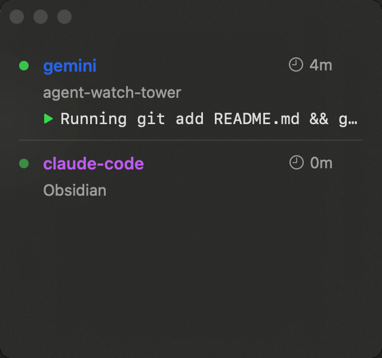
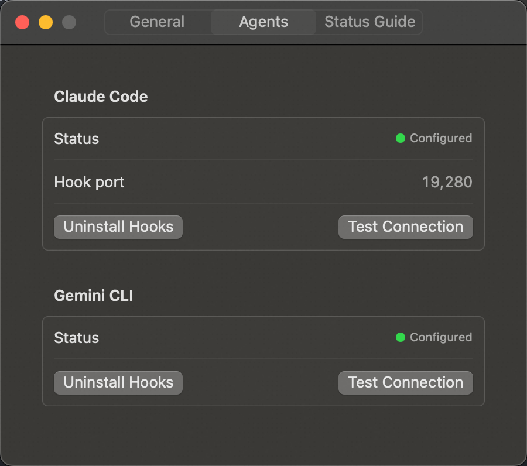
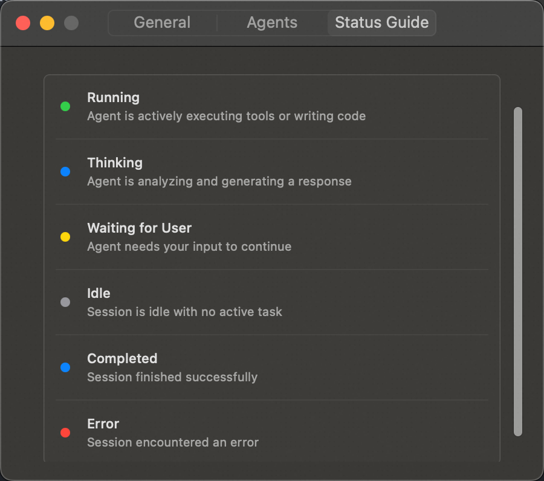

# Agent Watch Tower

macOS 原生菜单栏应用，实时监控 AI Agent（Claude Code / Gemini CLI）的运行状态、工具调用和 Token 消耗。

```
  🗼 ← 菜单栏常驻图标（运行中状态提示）
   │
   ▼ 点击展开 / 打开独立悬浮窗
 ┌──────────────────────────────────────┐
 │  Agent Watch Tower                   │
 │  Today: 15.2k tokens · $0.46        │
 ├──────────────────────────────────────┤
 │  ● claude-code           ⏱ 23m      │
 │    my-project/                       │
 │    ▶ Editing auth.ts                 │
 │    ████████████░░░░░░  5/8 tasks     │
 │    Tokens: 3.2k in · 1.8k out       │
 ├──────────────────────────────────────┤
 │  ● gemini                ⏱ 8m       │
 │    api-server/                       │
 │    ▶ Running command...              │
 └──────────────────────────────────────┘
```

## 界面预览

| 独立悬浮窗 (多 Agent 状态) | Agent 自动配置与连接测试 | 状态指示灯说明 |
|:---:|:---:|:---:|
|  |  |  |

## 功能特性

- **多 Agent 支持** — 同时支持监控 Claude Code 和 Gemini CLI
- **菜单栏监控** — 图标实时反映 Agent 状态（空闲 / 运行 / 错误警告），显示活跃数量
- **会话卡片** — 项目目录、当前动作、任务进度条、Token 用量一目了然，全新无边界扁平化设计
- **独立悬浮窗** — 支持切换为独立悬浮窗，always-on-top 且记住位置，不遮挡工作
- **一键 Hook 安装** — 提供界面分别管理 Claude Code 和 Gemini CLI 的 Hooks，自动配置
- **详情时间线** — 每个工具调用的输入/输出、耗时、Token 消耗，支持展开查看
- **工具分布图** — Edit / Read / Bash / Grep 等工具使用频次可视化
- **费用估算** — 基于模型定价自动计算 Token 花费
- **数据本地存储** — SQLite 数据库，所有数据留在本机，无遥测

## 系统要求

- macOS 14 (Sonoma) 或更高
- Swift 5.9+（仅构建时需要）
- Claude Code 或 Gemini CLI（被监控的 Agent）

## 快速开始

### 1. 构建安装

```bash
git clone <repo-url> && cd agent-watch-tower

# 构建 .app 并安装到 /Applications
make install

# 或仅构建不安装
make bundle
# 产物: .build/AgentWatchTower.app
```

### 2. 启动应用

```bash
make run-release
# 或双击 /Applications/AgentWatchTower.app
```

菜单栏出现图标即为运行成功。

### 3. 安装 Hook

点击菜单栏图标 → 顶栏齿轮图标 **(Settings)** → 切换至 **Agents** 标签页。

界面将分别显示 **Claude Code** 和 **Gemini CLI** 的配置状态。
- 点击对应的 **Install Hooks**，程序会自动将配置分别写入 `~/.claude/settings.json` 或 `~/.gemini/settings.json`。
- 可以随时点击 **Test Connection** 确保本地接收服务器 (`localhost:19280`) 运行正常。

### 4. 开始使用

正常使用 `claude` 或 `gemini` 命令行工具即可。每次 Agent 运行时，Watch Tower 会自动接收事件并实时更新面板。

## 构建命令

| 命令 | 说明 |
|---|---|
| `make build` | Debug 构建 |
| `make release` | Release 优化构建 |
| `make bundle` | 构建 Release + 组装 `.app` 包 |
| `make sign` | Ad-hoc 代码签名 |
| `make sign-dev` | Apple Development 证书签名 |
| `make install` | 签名 + 安装到 `/Applications` |
| `make run` | Debug 构建并直接运行 |
| `make run-release` | 构建 `.app` 并启动 |

## 架构

```
Sources/
├── App/                 # @main 入口 + AppDelegate 依赖注入
├── Models/              # AgentSession, AgentEvent, DailyUsage
├── Storage/             # GRDB/SQLite 持久化层
├── Server/              # Swifter HTTP 服务器 + EventProcessor Actor
├── Adapters/            # AgentAdapter 协议 + ClaudeCodeAdapter / GeminiAdapter
├── Utilities/           # HookInstaller, CostCalculator, TranscriptParser
├── Window/              # StatusBar, Popover, FloatingPanel
├── ViewModels/          # @Observable MVVM
└── Views/
    ├── Panel/           # 会话列表、卡片、日汇总、工具栏
    ├── Detail/          # 事件时间线、工具分布图
    ├── Settings/        # 设置窗口 (多Agent配置)
    └── Components/      # 状态指示灯、进度条、Token 标签
```

### 数据流

```
Agent Hook 事件 (Claude/Gemini)
  → HTTP POST localhost:19280
    → EventServer (Swifter)
      → EventRouter
        → EventProcessor (Swift Actor，串行处理)
          → 对应 AgentAdapter 转为统一模型
            → GRDB 写入 SQLite
              → NotificationCenter 通知
                → @Observable ViewModel 刷新
                  → SwiftUI 自动重绘
```

## 路线图

| 阶段 | 内容 | 状态 |
|---|---|---|
| M1 | Menu Bar 基础框架 | ✅ |
| M2 | HTTP Server + Hook 配置 | ✅ |
| M3 | 简要面板 UI + 独立悬浮窗 | ✅ |
| M4 | 详情视图 + 事件时间线 | ✅ |
| M5 | Gemini CLI 接入 | ✅ |
| M6 | 统计分析看板 | ✅ |
| M7 | 原生系统通知接入 | 计划中 |

## License

MIT
